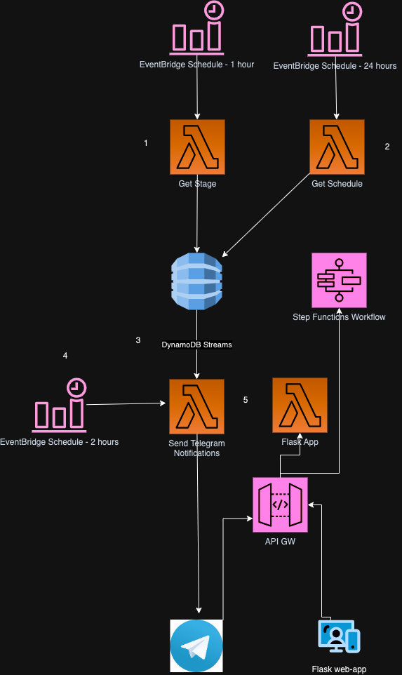

# Loadshedding Power Updater Telegram Bot
Telegram Bot that provides Eskom Loadshedding updates - running on AWS Serverless

Loosely-based off https://github.com/daffster/mypowerstats, but completly re-written to run as a Telegram bot, running on AWS Lambda and DynamoDB, deployed using AWS SAM.

Pulls loadshedding stage and schedule info from https://loadshedding.eskom.co.za/LoadShedding/, and makes it available as a Telegram bot. This bot can be added to your Telegram community groups/channels, and will post the schedule for your area.

The bot will post the following information five times a day (or depending on the EventBridge Schedule):
```
Buccleuch Loadshedding Notice 
Stage 3  
The loadshedding schedule for today - Mon, 03 Apr: 
  14:00  -  16:30
  
The loadshedding schedule for tomorrow - Tue, 04 Apr: 
 06:00  -  08:30
 14:00  -  16:30
 22:00  -  00:30

```

The bot also supports you asking it for the schedule on an ad-hoc basis using the `/schedule` command

## Architecture 


1. `get_schedule_lambda.py` Lambda function gets invoked via cron schedule (EventBridge rule) to hit the [Eskom loadshedding status endpoint](https://loadshedding.eskom.co.za/LoadShedding/GetStatus) and get the loadshedding stage. This is stored on Dynamo, for each area/location/suburb.
2. A filter is setup on DynamoDB Streams to send changes to the `notification_lambda.py` Lambda service. If the loadshedding stage has changed, the new stage will be sent, which will be posted to Telegram
3. Once a day, `get_schedule_lambda.py` Lambda function gets invoked via cron schedule (EventBridge rule) to hit the [Eskom loadshedding schedule endpoint](https://loadshedding.eskom.co.za/LoadShedding/GetScheduleM) and store the schedule in DynamoDB. 
4. A filter is setup on DynamoDB Streams to send changes to the `notification_lambda.py` Lambda service. If the loadshedding schedule has changed, it will be posted to Telegram
5. Every 2 hours, `notification_lambda.py` Lambda function gets invoked via cron schedule (EventBridge rule) to send loadshedding reminders. It reads the latest stage and schedule from DynamoDB, and posts to Telegram

## How to run it
To build and deploy to AWS using AWS SAM, then:

- Install [AWS CLI](https://docs.aws.amazon.com/cli/latest/userguide/install-cliv2.html), and  [configure it](https://docs.aws.amazon.com/cli/latest/userguide/cli-configure-quickstart.html#cli-configure-quickstart-config)
- Install [AWS SAM CLI](https://docs.aws.amazon.com/serverless-application-model/latest/developerguide/serverless-sam-cli-install.html)
- Run `sam build && sam deploy` to deploy to AWS
- Update the [Lambda environment variables](https://docs.aws.amazon.com/lambda/latest/dg/configuration-envvars.html) for `PowerUpdaterTableName`, `TelegramBotToken` and `TelegramChatID`
- Update your Telegram bot to change from polling to Webhook, by pasting this URL in your browser, or curl'ing it - Use your own bot token and Lambda URL endpoint: https://api.telegram.org/bot12334342:ABCD124324234/setWebHook?url=https://1fgfgfd56.lambda-url.eu-west-1.on.aws/. You can check that it was set correctly by going to https://api.telegram.org/bot12334342:ABCD124324234/getWebhookInfo, which should include the url of your Lambda URL, as well as any errors Telegram is encounterting calling your bot on that API.


## TODO

- Even though area is a field in the DB, need to configure it properly for multiple areas
- Pull announcements from https://twitter.com/Eskom_SA
